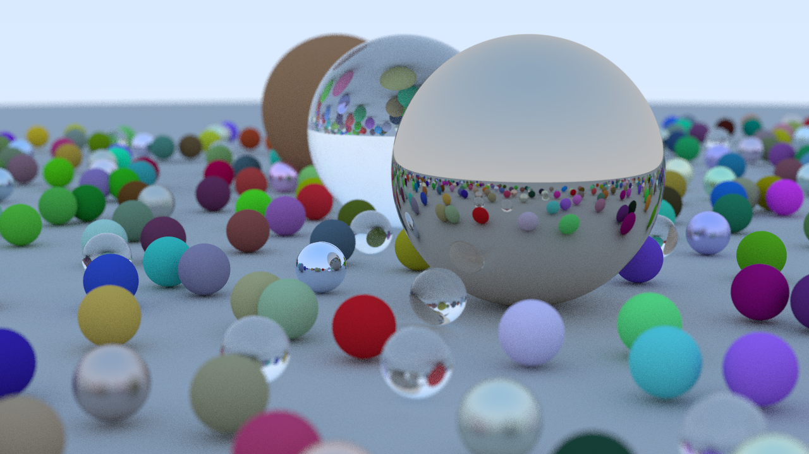

[](https://pkg.go.dev/fortio.org/tray)
[](https://goreportcard.com/report/fortio.org/tray)
[](https://github.com/fortio/tray/releases/)
[](https://github.com/fortio/tray/actions/workflows/include.yml)
[](https://codecov.io/github/fortio/tray)

# TRay

Ray tracing in the terminal. Extending ansipixels.

Inspired by the [Ray Tracing In One Weekend](https://raytracing.github.io/books/RayTracingInOneWeekend.html) book.


Current demo scene




## Install
You can get the binary from [releases](https://github.com/fortio/tray/releases)

Or just run
```
CGO_ENABLED=0 go install fortio.org/tray@latest  # to install (in ~/go/bin typically) or just
CGO_ENABLED=0 go run fortio.org/tray@latest  # to run without install
```

or
```
brew install fortio/tap/tray
```

or even - but multicast that we need doesn't seem to work at least on docker for mac.
```
docker run --network host -v ~/.tray:/home/user/.tray -ti fortio/tray
```


## Usage

Hit a key to hide the splash info. After which any key causes a re-render, 'Q' to quit.

Save the full resolution image using `-save file.png`.

More options (number of workers, rays per pixel, image super sampling, etc...)
```
tray help

flags:
  -d int
        Maximum ray bounce depth (default 12)
  -exit
        Exit immediately after rendering the image once (for timing purposes)
  -profile-cpu string
        Write CPU profile to file
  -r int
        Number of rays per pixel (default 64)
  -s float
        Image supersampling factor (default 4)
  -save string
        Save the rendered image to the specified PNG file
  -w int
        Number of parallel workers (0 = GOMAXPROCS)
```
